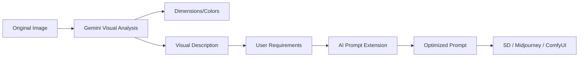

# 🎨 AI Image Pre-Editor & Prompt Refiner

[](https://image-pre-edit.vercel.app)

[🔥 Live Demo (Custom Domain)](https://image.108923.xyz/) | [Generic Domain](https://image-pre-edit.vercel.app/)


An intelligent workspace for image pre-processing, analysis, and AI prompt engineering. Optimized for Stable Diffusion, Midjourney, and LoRA training workflows.

## 🌟 Core Features

### 1. 🖼️ Image Pre-processing & Analysis
- **NEW! Sticker Management**: Drag and drop stickers directly onto the canvas. Visual overlays (stickers) are automatically rendered *below* drawing layers for seamless editing.
- **Automatic Semantic Extraction**: Deeply understands scene composition, subjects, and lighting.
- **Smart Cropping & Resizing**: Prepare images for diverse aspect ratio requirements.
- **Dominant Color Analysis**: Extracts hex codes and color relationships for design consistency.

### 2. 🧠 AI-Powered Prompt Extension (Powered by Google Gemini)
- **Model Upgrade**: Now utilizing **Google Gemini 1.5 Flash / 2.0 Flash Lite** for superior speed and visual understanding.
- **Smart Rate Limiting**: Built-in intelligent retry logic automatically handles API rate limits (429 errors), ensuring high success rates even on free tiers.
- **Instruction-First Logic**: The AI treats user modifications as the absolute highest priority.
- **Professional Augmentation**: Automatically enriches simple keywords with technical descriptors.

### 3. ⚡ Smart Architecture
- **Private & Configurable**: Direct integration with Google Gemini API.
- **Vercel Ready**: Seamlessly deploy frontend and backend to Vercel.

## 🔄 Intelligent Workflow



## 🛠️ Technical Stack

- **Frontend**: React 18, Vite, Tailwind CSS, Lucide Icons, Zustand, Konva.js.
- **Backend**: FastAPI (Python 3.10+).
- **Core AI**: Google Gemini API (gemini-flash-latest).

## 🚀 Getting Started

### 1. Requirements
- Node.js & npm/pnpm
- Python 3.10+
- Google Gemini API Key

### 2. Environment Setup
Create a `.env` file (not tracked in Git) in the `backend` directory:
```env
GEMINI_API_KEY=AIzaSymylongapikey...
```

For Frontend (Optional, for Vercel deployment):
```env
VITE_API_URL=https://your-backend-production-url.com
```

### 3. Local Run
```bash
# Install dependencies
npm install
pip install -r backend/requirements.txt

# Start backend (Port 8011)
python backend/main.py

# Start frontend (Port 3333)
npm run dev
```

## 🌐 Vercel Deployment

This project is optimized for Vercel.
1. Import your GitHub repository.
2. Set the Environment Variable `GEMINI_API_KEY` in Vercel Project Settings.
3. The `vercel.json` and `api/index.py` bridge will automatically handle backend routing.

---
*Created with ❤️ for the AI Art Community.*
