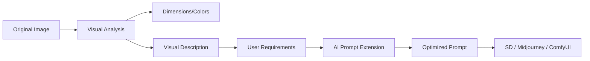

# 🎨 AI Image Pre-Editor & Prompt Refiner

An intelligent workspace for image pre-processing, analysis, and AI prompt engineering. Optimized for Stable Diffusion, Midjourney, and LoRA training workflows.

## 🌟 Core Features

### 1. 🖼️ Image Pre-processing & Analysis
- **Automatic Semantic Extraction**: Deeply understands scene composition, subjects, and lighting.
- **Smart Cropping & Resizing**: Prepare images for diverse aspect ratio requirements.
- **Dominant Color Analysis**: Extracts hex codes and color relationships for design consistency.

### 2. 🧠 AI-Powered Prompt Extension
- **Instruction-First Logic**: The AI treats user modifications as the absolute highest priority (e.g., "Make it cinematic blue").
- **Professional Augmentation**: Automatically enriches simple keywords with technical descriptors (lighting, camera lens, art style).
- **Instruction Strictness**: Maintains visual consistency while strictly following editing directives.

### 3. ⚡ Local-Cloud Hybrid Architecture
- **Private & Free**: Leverages local **Ollama (Qwen-VL)**算力 via DDNS tunnels.
- **Vercel Ready**: Seamlessly deploy the frontend and API bridge to Vercel for remote access without exposing local secrets.

## 🔄 Intelligent Workflow



## 🛠️ Technical Stack

- **Frontend**: React 18, Vite, Tailwind CSS, Lucide Icons, Zustand.
- **Backend**: FastAPI (Python 3.9+).
- **Core AI**: Qwen-VL (OpenSource Multimodal Model).

## 🚀 Getting Started

### 1. Requirements
- Node.js & npm/pnpm
- Python 3.9+
- A running Ollama instance with `qwen3-vl` (or similar multimodal model).

### 2. Environment Setup
Create a `.env` file (not tracked in Git):
```env
QWEN_VL_ENDPOINT=http://your-ddns-or-local-ip:11434/v1
QWEN_VL_API_KEY=ollama
```

### 3. Local Run
```bash
# Install dependencies
npm install
pip install -r backend/requirements.txt

# Start backend
python backend/main.py

# Start frontend
npm run dev
```

## 🌐 Vercel Deployment

This project is optimized for Vercel. Simply import your GitHub repository and set the environment variables. The `vercel.json` will automatically route `/api/*` calls to the Python backend bridge.

---
*Created with ❤️ for the AI Art Community.*
